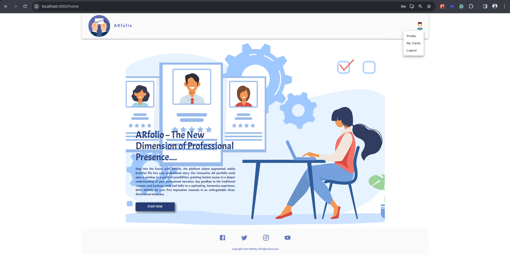
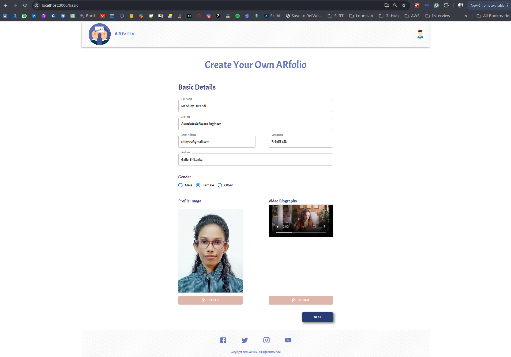
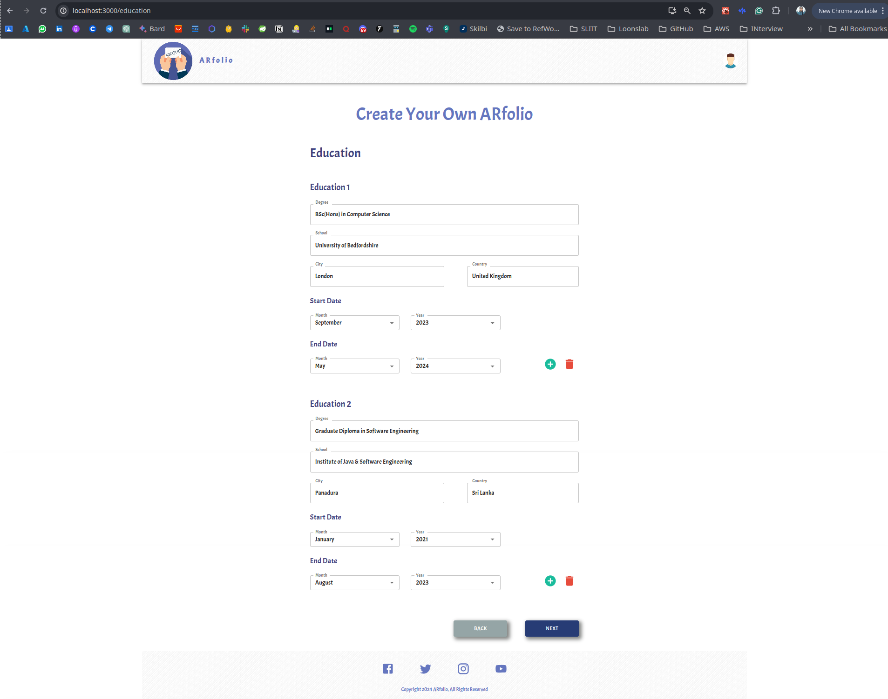
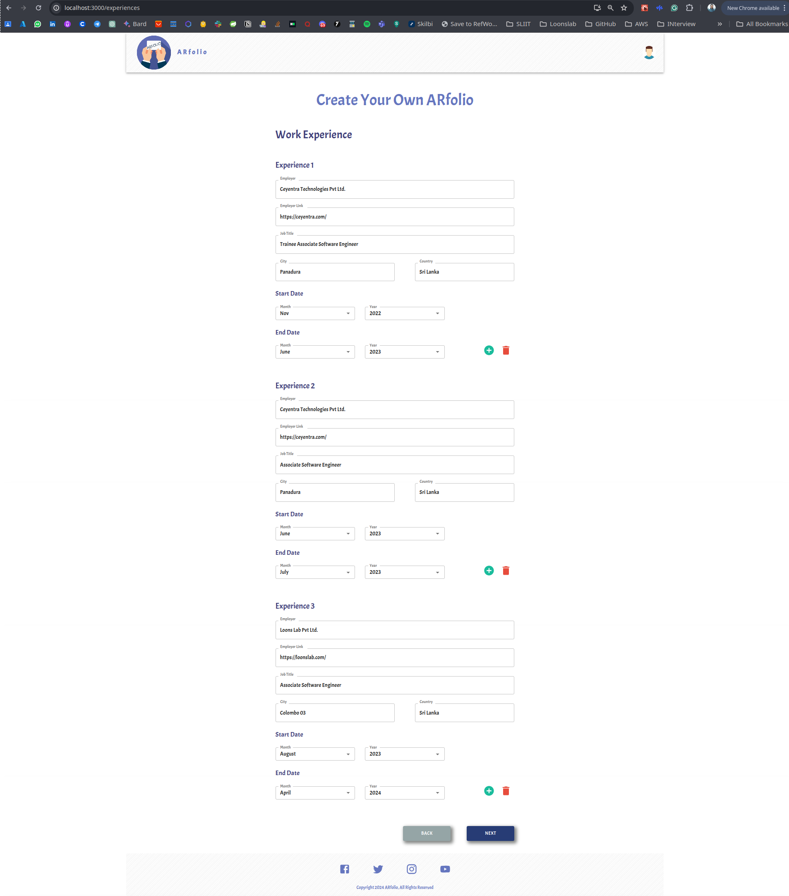
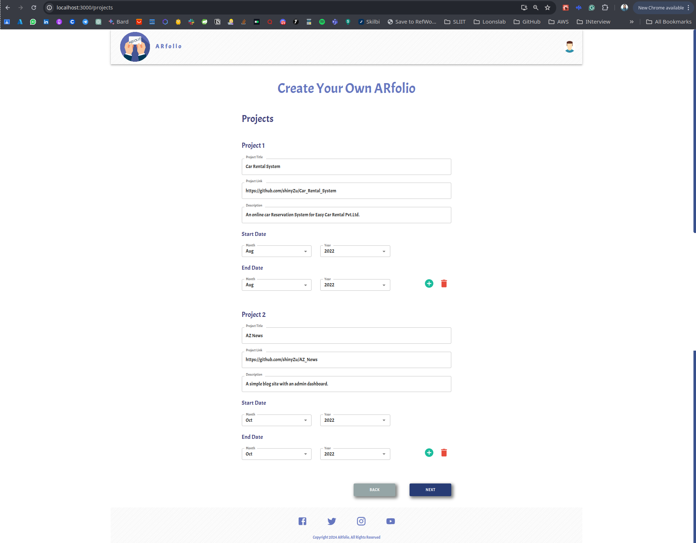
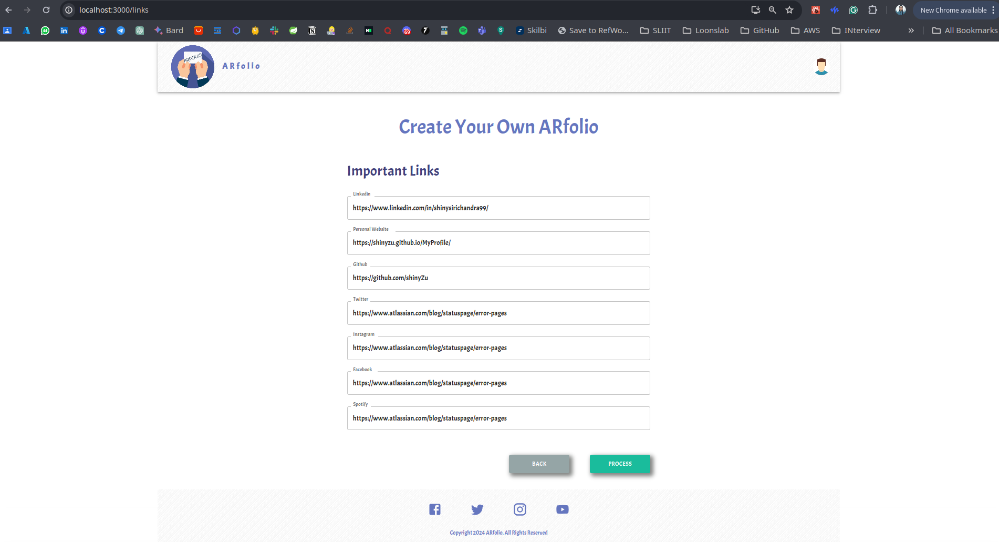
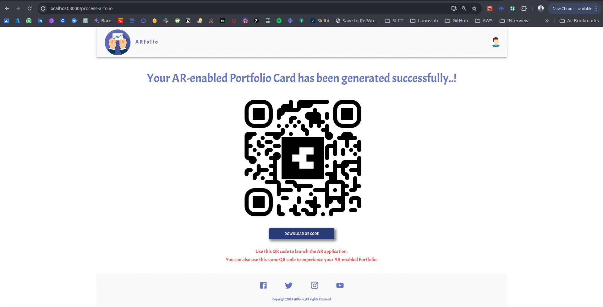

# ARfolio

### Implementing Augmented Reality-Enabled Portfolio Cards

## Technology Stack :

(MERN Stack)

- MongoDB
- Express JS
- React JS
- Node JS
- A-Frame
- Other - MUI Components

 

## Links :

- [Demo](https://drive.google.com/file/d/1Uihue3btj9WNQ96Sz4uLQ1Gx67j_DLyu/view?usp=sharing)
- [Postman Documentation](https://documenter.getpostman.com/view/21404145/2sA3JFBjUb)
- [GitHub](https://github.com/shinyZu/ARfolio)

 

## Screenshots :

Login Page

Registration Page

Home Page

Basic Details Form

Education Details Form

Work Experience Details Form

Project Details Form

Important Links

QR Code Preview Page

AR-enabled Portfolio

